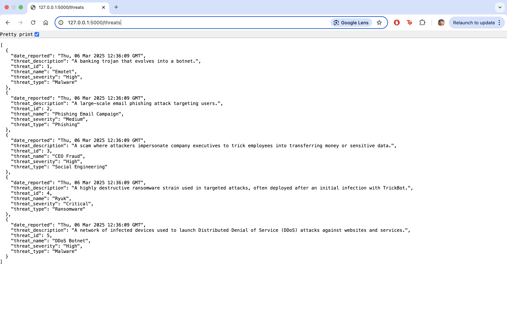
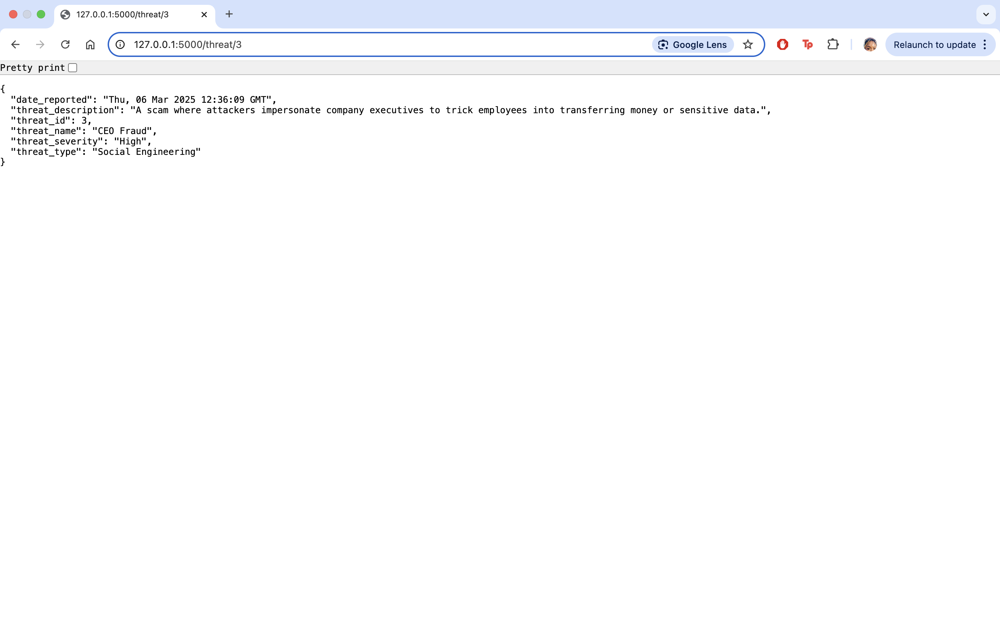
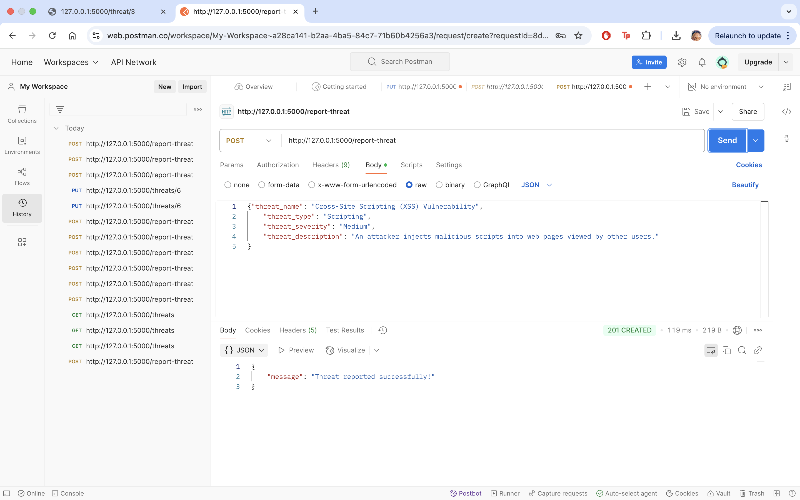
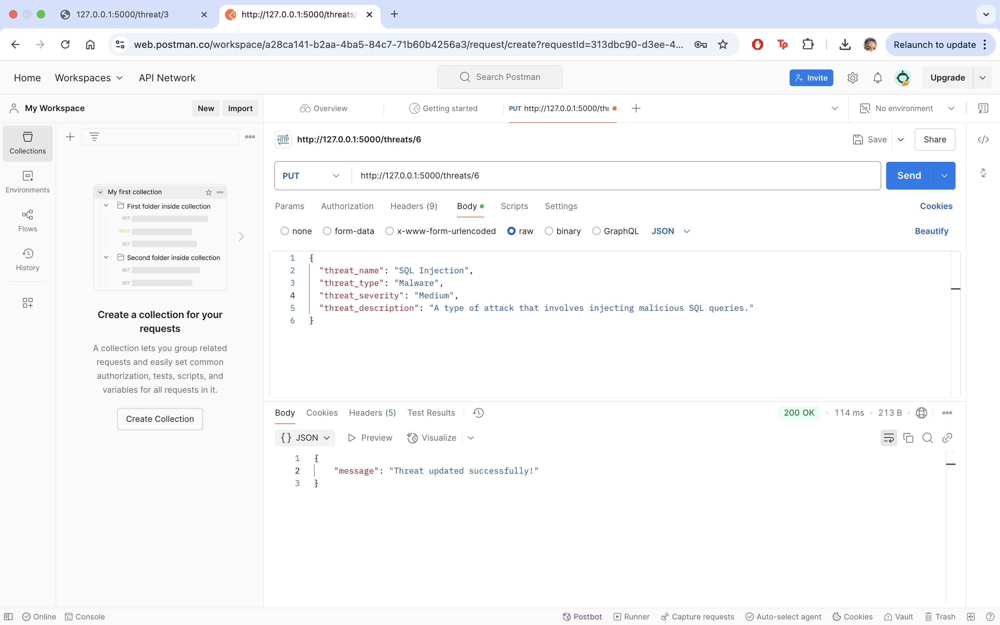

# Threat Intelligence API🧙🏾
This project is a simple, yet powerful Threat Intelligence API designed to track and report various types of 
cybersecurity threats. The API allows users to view known threats, fetch detailed information about specific 
threats, and report new threats. It is backed by a MySQL database and features endpoints to interact with the
data in a meaningful and organised way.

The project demonstrates the application of Flask for building web APIs, SQL for database management, and best
practices in exception handling. The API is designed to be easily extendable and could be further developed to integrate
with threat intelligence platforms or real-time monitoring systems.

## Table of Contents
- [Installation](#installation)
- [Running the Application](#running-the-application)
- [API Endpoints](#api-endpoints)
- [Testing the API](#testing-the-api)

## Access the Repository
The project files are attached to this repository. To run and test the API clone the repository to your local machine:
`git clone <https://github.com/sirenc0de/CFG-Assignments>
cd <CFG-Assignments>`

### Install Required Dependencies
Install the required Python libraries using pip:
`pip install -r requirements.txt`

### Running the Application
Start the Flask application by running main.py file or executing `python main.py` via the terminal.
The API will be running on http://127.0.0.1:5000.

## API Endpoints
1. GET /threats: Retrieve a list of known threats.
* URL: http://127.0.0.1:5000/threats

2. GET /threat/<threat_id>: Fetch details of a specific threat.
URL: http://127.0.0.1:5000/threats/<threat_id>
- Replace <threat_id> with the threat's ID (e.g. 7).

3. POST /report-threat: Log a new threat to the database.
URL: http://127.0.0.1:5000/report-threat
- Body (JSON): 
`{
"threat_name": "Threat Name",
"threat_type": "Threat Type",
"threat_severity": "Threat severity level",
"threat_description": "Brief description of threat."
}`

4. PUT /update-threat/<threat_id>: Update existing threat record.
URL: http://127.0.0.1:5000/update-threat/<threat_id>

